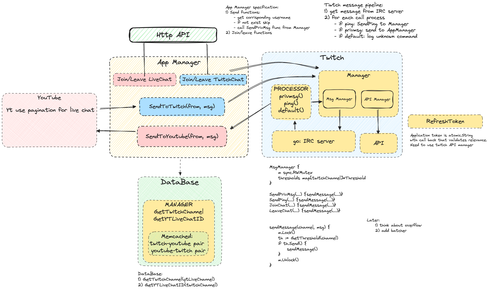

# MultiChat Bot

## Progress

### Backend

Go 1.20.0

Дизайн системы:

#### AppManager

#### Twitch

1. Manager. Предоставляет интерфейс для работы с Twitch, как API, так и IRC.
2. Message Service. Предоставляет интерфейс для IRC. Нужен для работы с rate limit'ами.
3. API Manager. Предоставляет интерфейс для работы с API.
4. IRC Client. Websocket клиент принимающий и отправляющий сообщения.
5. Processor. Обрабатывает различные типы сообщения приходящих из IRC Client, нужен для удобной единой точки вызова
   функционала AppManager или twitch.Manager.

### Frontend

- singe page website
- [light theme](https://www.realtimecolors.com/dashboard?colors=1c0e03-ffffff-1361a4-d7bff8-197bd2&fonts=Ubuntu-Ubuntu)
- [dark theme](https://www.realtimecolors.com/dashboard?colors=fceee3-000000-5ba8ec-1f0740-2d90e6&fonts=Ubuntu-Ubuntu)
- [font](https://fonts.google.com/specimen/Ubuntu)
- [svg collection](https://www.svgrepo.com/collection/coolicons-line-oval-icons/1)
- [svg with google/twitch](https://www.svgrepo.com/collection/phosphor-bold-icons/)
- [logo](https://www.svgrepo.com/svg/324471/robot-artificial-intelligence-android)
